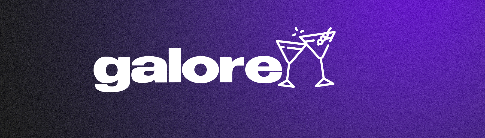

# Galore

Galore an android only (for now) application made for people who like to make their own cocktails. It's made with Kotlin & Jetpack Compose.

**[Figma Design](https://www.figma.com/file/c4NQMvTuwxNo05w5DGwu9i/Galore?type=design&node-id=1026%3A872&mode=design&t=erb9I6RqLc26TbGE-1)**

The app is made using Clean Architecture and Use Cases along side a backend made in Supabase.

**Tecnologies & Libraries overview:**
-  Kotlin
- Jetpack Compose 
- Material 3
- Hilt & Dagger 
- Coil
- Supabase
- Espresso
- Use Case & Clean Architecture

# Screenshots

---
License MIT © [Sebastijan Zindl](./LICENSE)

